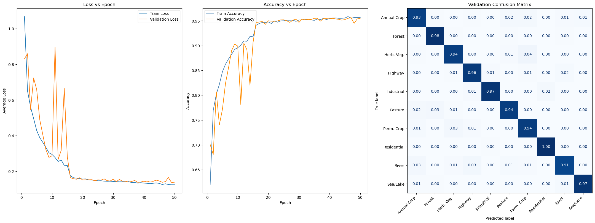

# EuroSAT PyTorch Classifier

This is a Convolutional Neural Network model developed with PyTorch for classifying the EuroSAT dataset. It achieves 95.23% test accuracy and 95.63% validation accuracy. The section below describes the model specifications:

## Model Configuration

### Dataset

- **Dataset:** EuroSAT RGB
- **Classes:** 10
- **Image Size:** 64 × 64
- **Channels:** 3 (RGB)
- **Total Images:** 27,000
- **Split:** 70% train / 15% validation / 15% test
- **Random Seed:** 42

### Data Augmentation

This is only applied to the training set:

- Random 90° rotations
- Random horizontal flips
- Random vertical flips

### CNN Architecture

| Layer           | Configuration                                                   | Output Shape   |
| --------------- | --------------------------------------------------------------- | -------------- |
| Input           | RGB image                                                       | `3 × 64 × 64`  |
| Conv Block 1    | `Conv2d(3, 32, 3×3, padding=1)` + BatchNorm + ReLU + MaxPool    | `32 × 32 × 32` |
| Conv Block 2    | `Conv2d(32, 64, 3×3, padding=1)` + BatchNorm + ReLU + MaxPool   | `64 × 16 × 16` |
| Conv Block 3    | `Conv2d(64, 128, 3×3, padding=1)` + BatchNorm + ReLU + MaxPool  | `128 × 8 × 8`  |
| Conv Block 4    | `Conv2d(128, 256, 3×3, padding=1)` + BatchNorm + ReLU + MaxPool | `256 × 4 × 4`  |
| Flatten         | `256 × 4 × 4`                                                   | `4096`         |
| Fully Connected | `Linear(4096, 256)` + ReLU                                      | `256`          |
| Dropout         | `p = 0.2`                                                       | `256`          |
| Output          | `Linear(256, 10)`                                               | `10` logits    |

### Training Configuration

- **Loss Function:** Cross-Entropy Loss
- **Optimizer:** SGD
- **Initial Learning Rate:** `1e-3`
- **Momentum:** `0.9`
- **Batch Size:** `64`

### Learning Rate Scheduler

`ReduceLROnPlateau` monitors validation loss:

- **Mode:** `min`
- **Factor:** `0.1`
- **Patience:** `2`
- **Minimum Learning Rate:** `1e-4`

This allows the model to train quickly at `1e-3` before transitioning to the more stable `1e-4` fine-tuning phase once validation improvement stalls.

### Model Selection

The model checkpoint is updated whenever validation loss reaches a new minimum.

The best checkpoint is reloaded before final test evaluation rather than automatically using the final epoch.

### Final Results

- **Best Validation Accuracy:** 95.63%
- **Final Test Accuracy:** 95.23%
- **Test Set Size:** 4,050 images

 

## References

This project uses the [EuroSAT dataset](https://github.com/phelber/EuroSAT), a satellite image dataset containing 27,000 RGB images of over 10 classes.

P. Helber, B. Bischke, A. Dengel and D. Borth, "EuroSAT: A Novel Dataset and Deep Learning Benchmark for Land Use and Land Cover Classification," in IEEE Journal of Selected Topics in Applied Earth Observations and Remote Sensing, vol. 12, no. 7, pp. 2217-2226, July 2019, doi: 10.1109/JSTARS.2019.2918242.
